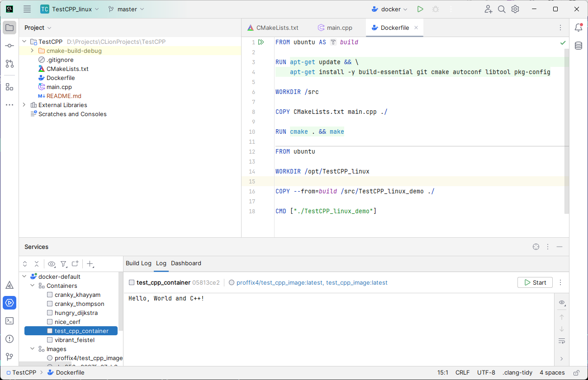

# TestCPP
Создание программы на C++ для Docker



**Команды в консоли:**

```
docker pull proffix4/test_cpp_image
```
```
docker run proffix4/test_cpp_image
```

*Видео:*
https://youtu.be/krPWB36wm7A